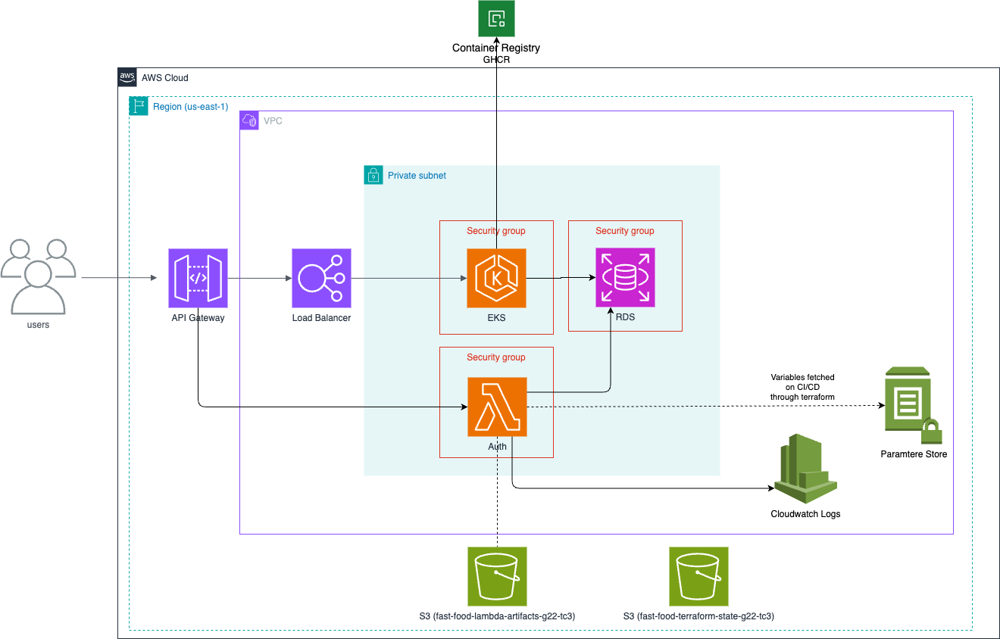

<a name="readme-top"></a>


# <p align="center"><b>Fast Food</b> <small>FIAP Tech Challenge 3 - G22 - K8s + TF</small></p>

<p align="center">
    
    
    
    
</p>


## 💬 About

Repository for the [FIAP](https://postech.fiap.com.br/) Tech Challenge 3, where we will deploy a Fast Food application using Terraform and Kubernetes.

> [!NOTE]
> Tech Challenge 3 API repository can be found [here](https://github.com/FIAP-SOAT-G20/fiap-tech-challenge-3-api)  


## 🏗️ Architecture

### :whale: AWS EKS


### :whale: Kubernetes


### :open_file_folder: Project Structure

```sh
.
├── backend.tf
├── data.tf
├── eks-access-entry.tf
├── eks-access-policy.tf
├── eks-cluster.tf
├── eks-node.tf
├── k8s
│   ├── app
│   │   ├── deployment.yaml
│   │   ├── hpa.yaml
│   │   ├── ingress.yaml
│   │   └── service.yaml
│   ├── config
│   │   ├── configmap.yaml
│   │   ├── metrics.yaml
│   │   └── secret.yaml
│   ├── mockserver
│   │   ├── deployment.yaml
│   │   ├── hpa.yaml
│   │   └── service.yaml
│   └── namespace.yaml
├── Makefile
├── outputs.tf
├── provider.tf
├── README.md
├── sg.tf
└── vars.tf
```

## :computer: Technologies

- [Terraform](https://www.terraform.io/)
- [Kubernetes](https://kubernetes.io/)

## :scroll: Requirements

### Build/Run Locally (development)

- [Terraform](https://www.terraform.io/)


<p align="right">(<a href="#readme-top">back to top</a>)</p>

## :cd: Installation

```sh
git clone https://github.com/FIAP-SOAT-G20/fiap-tech-challenge-3-k8s-tf.git
```

```sh
cd fiap-tech-challenge-3-k8s-tf
```

<p align="right">(<a href="#readme-top">back to top</a>)</p>

## :runner: Running

tf
### :gear: Terraform

```bash
make tf-init
```
```bash
make tf-plan
```
```bash
make tf-apply
```

Update AWS EKS kubeconfig for the newly created EKS cluster
```bash
make aws-eks-auth
```

### :gear: Kubernetes

```bash
make k8s-apply
```

> The resources will be created in the `tech-challenge-ns` namespace

> [!TIP]
> To view the application, run `make k8s-status` or `kubectl get all -n tech-challenge-ns`  
> To remove the application, run `make k8s-delete`

### :mag: Kubernetes Organization

The Kubernetes organization is divided into three main directories: `app`, `config`, and `postgres`.

- **app**: Contains the Kubernetes resources for the application, such as deployment, service, ingress, and HPA.
- **config**: Contains the Kubernetes resources for the configuration, such as ConfigMap and Secret.
- **mockserver**: Contains the Kubernetes resources for the Mock Server, such as deployment, service, and HPA.

```sh
.
├── app
│   ├── deployment.yaml
│   ├── hpa.yaml
│   ├── ingress.yaml
│   └── service.yaml
├── config
│   ├── configmap.yaml
│   └── secret.yaml
├── mockserver
│   ├── deployment.yaml
│   ├── hpa.yaml
│   └── service.yaml
└── namespace.yaml
```

<p align="right">(<a href="#readme-top">back to top</a>)</p>

## :clap: Acknowledgments

- [Provision an EKS cluster (AWS)](https://developer.hashicorp.com/terraform/tutorials/kubernetes/eks)
- [terraform-academy by Douglas (FIAP)](https://github.com/dougls/terraform-academy)

<p align="right">(<a href="#readme-top">back to top</a>)</p>

## :busts_in_silhouette: Contributors

<div align="center">
  <table>
    <tbody>
      <tr>
        <td align="center" valign="top" width="14.28%"><a href="https://github.com/atomaz"><br /><sub><b>Alice Tomaz</b></sub></a><br />
        <td align="center" valign="top" width="14.28%"><a href="https://github.com/filipe1309"><br /><sub><b>Filipe Leuch Bonfim</b></sub></a><br />
        <td align="center" valign="top" width="14.28%"><a href="https://github.com/hugokishi"><br /><sub><b>Hugo Kishi</b></sub></a><br />
        <td align="center" valign="top" width="14.28%"><a href="https://github.com/marcos-nsantos"><br /><sub><b>Marcos Santos</b></sub></a><br />
      </tr>
    </tbody>
  </table>
</div>

<p align="right">(<a href="#readme-top">back to top</a>)</p>
